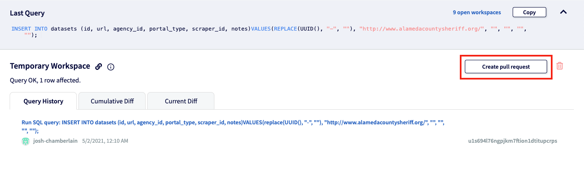

# Submit or update Datasets

## Dolt SQL Editor

You can use SQL statements to add new datasets right in Dolt. It's possible to generate these Insert statements from spreadsheets or write them manually.

### Using spreadsheets

1. Make a copy of the [Dataset Submission Template](https://docs.google.com/spreadsheets/d/1qh-6pb6KoIFSQ9qyyzd_bZIOosD74Sg21VPjbOQ5j3g/edit#gid=494854000) and populate information about new datasets as you work.
2. Use the [Dataset Properties](find-a-dataset-id/) guide to find the appropriate IDs
3. Navigate to the Query table and note that each row generates a new SQL query.
4. Paste the queries individually into the [DoltHub Datasets repo](https://www.dolthub.com/repositories/pdap/datasets) and run them.
5. When you're done, make a Pull Request and ask in \#datasets for someone to approve it.



## CLI

> This process is currently tricky due to column defaults. If you can improve these docs, click the link in the upper right to Edit on GitHub.

1. [Install Dolt](https://docs.dolthub.com/getting-started/installation).
2. Initialize the project locally.

   ```text
   dolt init
   dolt clone pdap/datasets && cd datasets
   dolt table export datasets > datasets.csv
   ```

3. Open the `datasets.csv` file, make changes, and save. Leave `id` blank—UUIDs are generated automatically. Make sure you're not adding a URL that already exists.

   ```text
   dolt branch <branch name e.g. add-CA-counties>
   dolt checkout <your branch>
   dolt table import -u datasets datasets.csv
   ```

4. Run this command to add your csv to your checked out branch.

   ```text
   dolt add .
   ```

5. Push the commit.

   ```text
   dolt commit -m “<message e.g. added 5 Alameda County datasets>”
   dolt push --set-upstream origin <your branch>
   ```

6. Head to [https://www.dolthub.com/repositories/pdap/datasets/](https://www.dolthub.com/repositories/pdap/datasets/)
7. Create a [Pull Request](https://docs.dolthub.com/dolthub/getting-started#pull-requests) to merge your dataset into master. Your branch should appear as an option.

