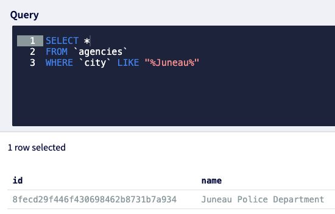

# Dataset Properties

## ID

A UUID, generated automatically.

Using any SQL editor, including the DoltHub UI, enter one of these queries to find a Dataset.

```sql
--find dataset id by city
SELECT *
FROM `datasets` 
JOIN `agencies` ON agencies.id = datasets.agency_id
WHERE agencies.city LIKE "%Antioch%"

--find dataset id by state
SELECT *
FROM `datasets` 
JOIN `agencies` ON agencies.id = datasets.agency_id
WHERE agencies.state_iso = "MD"

--find dataset id by county name
SELECT *
FROM `datasets`
JOIN `agencies` ON agencies.id = datasets.agency_id
JOIN `counties` ON counties.fips = agencies.county_fips
WHERE counties.name LIKE "%Bibb%"

--find datasets by agency id
SELECT *
FROM `datasets`
WHERE `agency_id` = "b27ae147ba004dec875eeaa5259ebb57"
```

## Agency ID



```sql
--find agencies by city name
SELECT * FROM `agencies` WHERE `city` like "%Juneau%"

--find agencies by state
SELECT * FROM `agencies` WHERE `state_iso` = "NJ"

--find agencies by county
SELECT * FROM `agencies`
JOIN counties ON agencies.county_fips=counties.fips
WHERE `counties.name` LIKE "%Bibb%"
```

## Source Type

```sql
SELECT * from `source_types`
```

## Data Type

```sql
SELECT * FROM `data_types`
```

## Format Type

```sql
SELECT * FROM `format_types`
```

## Can Scrape

Enter `0` if this dataset cannot legally be scraped.

