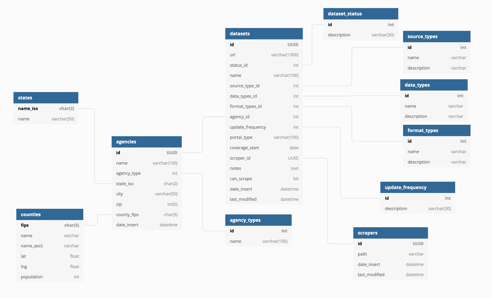

# Database Schema

The `agencies` table prevents redundancy in `datasets` and establishes a true one-to-many relationship \(one agency may have many associated datasets\). Agencies are described primarily by their location. 

Datasets are described primarily by an agency and the URL of the data.

`update_frequency`: annual, semi-annual, quarterly, monthly, weekly, daily

`agency_types`: federal, state, municipal, university

You can also view our schema [here](https://dbdiagram.io/d/607762c7b6aeb3052d90271b), with a little more interactability.

