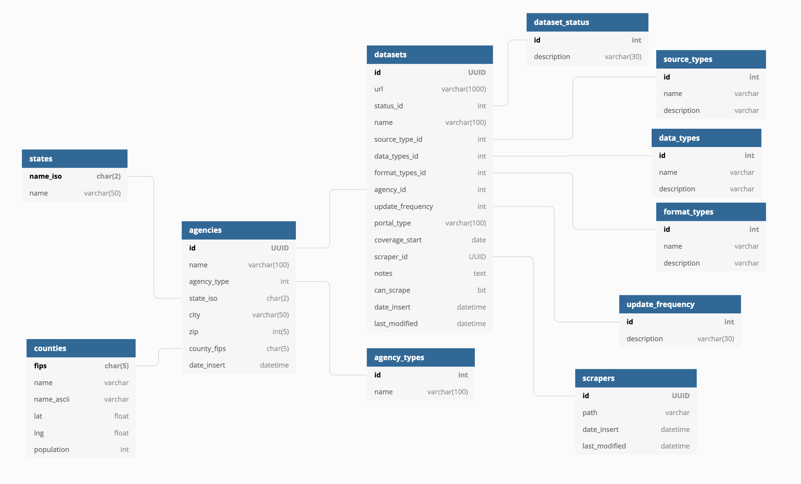

# Proposed Database Schema

The proposed database schema entails some major changes to achieve the goal of normalization in the database. Here are the changes:

* creation of a new `agencies` table to prevent redundancy of several columns in `datasets` and establish a true one-to-many relationship \(one agency may have many associated datasets\)
  * migrate `state_iso`, `county_fips`, `city_id` columns to `agencies` table
* creation of a new `update_frequencies` table to prevent redundancy and enforce normalization
  * remove hard-coded `update_frequency` column from `datasets` table and create a normalized link to `update_frequency` table
* creation of a new `agency_types` table to enforce normalization
  * remove hard-coded `aggregation_type`column from `datasets`, migrated to `agencies` table as `agency_type` and created a link to `agency_types` table
* remove `state_iso` and `county_fips`  columns from `municipalities` table to prevent circular foreign key with  `agencies` table

**Reference Table Data:**

I created two new  'reference tables' they will be \(at least initially\) seeded with the following values:

* `update_frequency`: annual, semi-annual, quarterly, monthly, weekly, daily
* `agency_types`: federal, state, municipal, university

