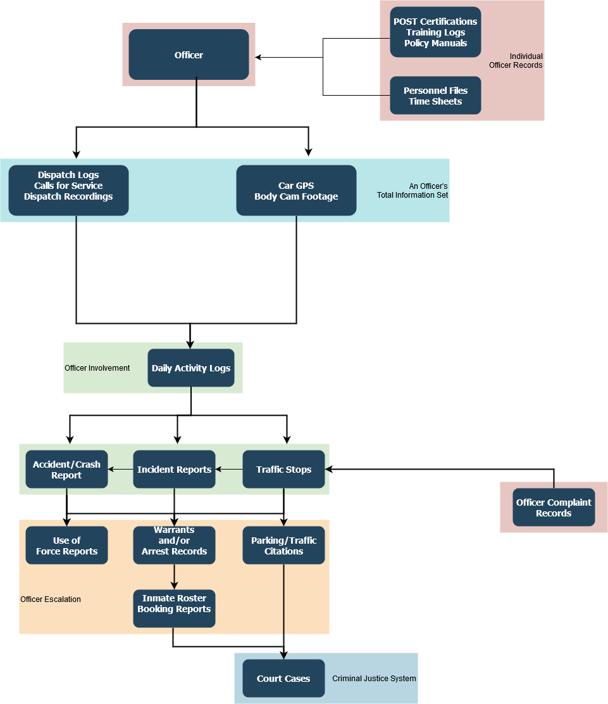

# 2020-11-18 Leadership Cadence

## Date 

18 Nov 2020

## Participants 

* [Eddie Brown (Unlicensed)](https://pdap.atlassian.net/wiki/people/5f2205e570fb250022c01aaa?ref=confluence)
* [Richard Ji](https://pdap.atlassian.net/wiki/people/5f8f95be0e068b00766b6903?ref=confluence)
* [Will Beaumont](https://pdap.atlassian.net/wiki/people/5e9c6021ca2a1d0c2e249bab?ref=confluence)
* [Former user (Deleted)](https://pdap.atlassian.net/wiki/people/5f8f95be40588b0077ed830a?ref=confluence)
* [Alec Akin (Unlicensed)](https://pdap.atlassian.net/wiki/people/5f1e64ee2aa25000286fc7fc?ref=confluence)
* [Josh Lintag](https://pdap.atlassian.net/wiki/people/5f20c61fc9c094001c5d32ca?ref=confluence)

## Goals 

* Compare/contrast alternatives to splunk
* High level picture conversation of how splunk/alternative fits in actual MVP

## Discussion topics 

| Item                                                          | Presenter                                                                                                                                                                                                                                | Notes                                                                                                                                                                                                                                                                                                                                                                                                                                                                                                                          |
| ------------------------------------------------------------- | ---------------------------------------------------------------------------------------------------------------------------------------------------------------------------------------------------------------------------------------- | ------------------------------------------------------------------------------------------------------------------------------------------------------------------------------------------------------------------------------------------------------------------------------------------------------------------------------------------------------------------------------------------------------------------------------------------------------------------------------------------------------------------------------ |
| Splunk alternative - ELK stack                                | 
<a href="https://pdap.atlassian.net/wiki/people/5f1e64ee2aa25000286fc7fc?ref=confluence">Alec Akin (Unlicensed)</a>

<a href="https://pdap.atlassian.net/wiki/people/5f8f95be0e068b00766b6903?ref=confluence">Richard Ji</a>
 | 
ELK (Elasticsearch, Logstash, Kibana)
<ul><li>Open source, free</li><li>Wealth of information for reference</li></ul>
Neither ELK nor splunk do particularly well with long term data storage; will still need some form of data lake solution

We’ve been considering splunk as a springboard in order to transition into something more flexible and maintainable.

Splunk resolves:
<ul><li>Immediacy</li><li>Security</li><li>Outsource maintenance and high availability for the most part</li></ul> |
| Planning                                                      | [Eddie Brown (Unlicensed)](https://pdap.atlassian.net/wiki/people/5f2205e570fb250022c01aaa?ref=confluence)                                                                                                                               | <ul><li>Still working with A&#x26;P to continue process</li><li>
Once we’re unblocked, where does the money need to go?
<ul><li>Splunk</li><li>???</li></ul></li></ul>                                                                                                                                                                                                                                                                                                                                                    |
| Interim work                                                  |                                                                                                                                                                                                                                          | <ul><li>Alec has a small, personal Splunk instance we can work off of as we wait for incorp/501c3</li><li>Could be a good time to spike out some learnings for outstanding problems whether we use splunk or not (long term data storage, exposing API for public use, determine how to validate data integrity, serving up data back to the public for free)</li></ul>                                                                                                                                                        |
| Accuracy of PDAP data arch diagram and data ingestion diagram |                                                                                                                                                                                                                                          | Still fairly accurate (1) (1).png>)                                                                                                                                                                                                                                                                                                                                                                                                |
|                                                               |                                                                                                                                                                                                                                          |                                                                                                                                                                                                                                                                                                                                                                                                                                                                                                                                |

## Action items 

* Working session for white boarding architecture for splunk/alternative with MVP [Alec Akin (Unlicensed)](https://pdap.atlassian.net/wiki/people/5f1e64ee2aa25000286fc7fc?ref=confluence)
* Working session for some splunking learning [Alec Akin (Unlicensed)](https://pdap.atlassian.net/wiki/people/5f1e64ee2aa25000286fc7fc?ref=confluence)
* Reach out to folks for documenting emails [Former user (Deleted)](https://pdap.atlassian.net/wiki/people/5f8f95be40588b0077ed830a?ref=confluence)

## Decisions 

*
